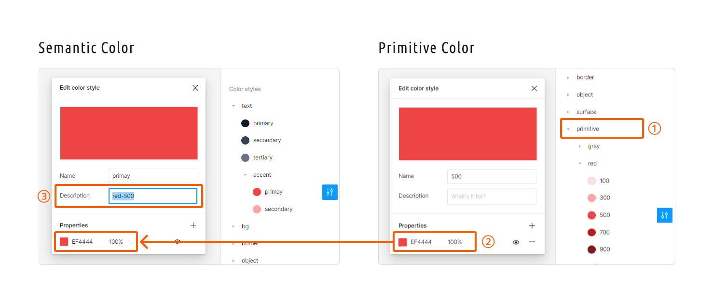

# Tokens to Tailwind CSS (Figma plugins)
This plugin generates utility classes for Tailwind CSS from design tokens set in the local style of Figma.

*Currently only color styles are supported.

## Instructions
1. Create a local styles.
2. Run this plugin.
3. Select some options and press generate button.
4. Copy and paste the generated code into the Tailwind CSS configuration file.

## Options
### Primitive colors
If this option is checked, the primitive styles referenced by the semantic style are generated as CSS variables.

#### How to set up in Figma
1. Classify the style by the prefix of your choice.
2. Set the semantic style to the same value as the primitive style.
3. Enter the name of the primitive style, excluding the prefix, in the semantic style Description.



read more:
https://tailwindcss.com/docs/customizing-colors#using-css-variables

### Classify by keys
If this option is checked and the style name matches a specific value, the style is classified under the corresponding key.

For example
```js
// If there is no match, everything is classified as 'colors'
colors: {
  primary: '#000000', // primary
  object: {
    primary: '#000000', // object/primary
  },
},
// If the style name begins with 'bg/'
backgroundColor: {
  primary: '#000000', // bg/primary
  secondary: '#000000', // bg/seconcary
},
// If the style name starts with 'text/'
textColor: {
  primary: '#000000', // text/primay
  accent: {
    primay: '#000000', // text/accent/primay
  },
},
```

The correspondence between style names and keys is as follows.

| style name | key |
|--------|-------|
| accent/* | accentColor |
| bg/* | backgroundColor |
| border/* | borderColor |
| shadow/* | boxShadowColor |
| caret/* | caretColor |
| divide/* | divideColor |
| outline/* | outlineColor |
| placeholder/* | placeholderColor |
| ring/* | ringColor |
| ring-offset/* | ringOffsetColor |
| text/* | textColor |
| decoration/* | textDecorationColor |

read more:
https://tailwindcss.com/docs/theme#configuration-reference
